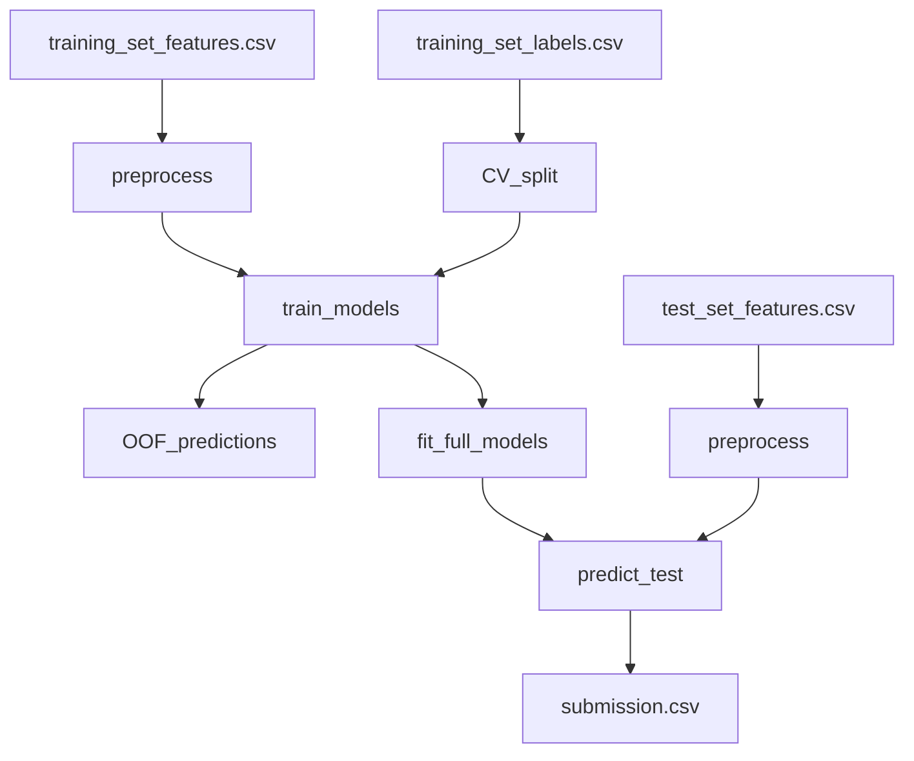

# Flu Shot Learning rerun: 3 approaches

## Context (from provided docs/data)

- **Task**: predict two independent probabilities per respondent: `h1n1_vaccine`, `seasonal_vaccine` (multilabel, not multiclass).
- **Metric**: ROC AUC per label, averaged across the two labels (macro mean of the two AUCs).
- **Data**: 35 features + `respondent_id`; mix of numeric/ordinal/binary and categorical strings; missing values present.
- References: competition problem description ([DrivenData](https://www.drivendata.org/competitions/66/flu-shot-learning/page/211/)) and official tutorial ([Tutorial Lesson 1](https://drivendataorg.github.io/tutorial-flu-shot-learning/01_tutorial.html)).

## Shared foundation (used by all 3 approaches)

### Repository structure (proposed)

- `[data/](data/)`: keep as-is (competition CSVs)
- `[src/](src/)`: reusable code (data loading, preprocessing, metrics, training)
- `[configs/](configs/)`: model + CV configs (YAML/JSON)
- `[runs/](runs/)`: local outputs (OOF preds, trained models, submission files)
- `[notebooks/](notebooks/)`: EDA + analysis notebooks (optional)
- `[README.md](README.md)`: how to run training and generate submission

### Core workflow

- **Load**: join `training_set_features.csv` with `training_set_labels.csv` on `respondent_id`.
- **Split**: K-fold CV with fixed seed; evaluate both targets on identical folds.
  - Default: `StratifiedKFold` on a combined label to keep balance across multilabel patterns, e.g. `y = 2*h1n1 + seasonal` (0..3).
- **Preprocess**:
  - Identify numeric-like vs categorical columns.
  - Missingness handling per model family (impute vs native missing).
  - Keep `respondent_id` only for indexing/merging; never as a feature.
- **Train**: either (a) two independent models (one per target) or (b) one multitask model with two heads; produce **out-of-fold (OOF)** probabilities.
- **Validate**: compute `roc_auc(h1n1)` and `roc_auc(seasonal)` + their mean.
- **Fit full**: train on full training set using best config.
- **Predict**: produce `submission.csv` matching `submission_format.csv`.

### Dataflow (common)

## Approach 1 — Simple baseline (basic packages)

Goal: fast, clean baseline you can run in minutes and iterate on.

### Model

- **Logistic Regression** (two independent models) with:
  - `ColumnTransformer`:
    - numeric: `SimpleImputer(strategy="median")` (or mean) + optional `StandardScaler`
    - categorical: `SimpleImputer(strategy="most_frequent")` + `OneHotEncoder(handle_unknown="ignore")`
  - `LogisticRegression(solver="liblinear" or "saga", C tuned lightly, class_weight=None by default)`

### Discover/deepen hooks

- Start with all features; then:
  - Try treating ordinal-coded categories as numeric vs one-hot (quick ablation).
  - Add missingness indicators for high-missing columns (simple + often helpful).

### Deliverables

- Single script/entry point to:
  - train CV
  - write OOF metrics report
  - train full
  - output submission

## Approach 2 — Deep analysis + model selection + tuning (expert libs)

Goal: systematically push leaderboard score via stronger models, better validation, and careful feature handling.

### Analysis phase

- **Missingness map**: which columns are missing, how much, and whether missingness correlates with labels.
- **Cardinality checks** for categoricals (notably `hhs_geo_region`, `employment_industry`, `employment_occupation`).
- **Leakage sanity checks**: confirm no target-like columns; verify train/test categorical levels overlap.
- **Fold stability**: compare CV strategies:
  - Stratify on `2*h1n1 + seasonal`
  - Stratify on `seasonal` only (as a control)
  - Repeated CV for variance estimation

### Model candidates

- **LightGBM** (two models):
  - Native handling of missing values; encode categoricals as pandas `category` or ordinal int codes + pass categorical feature indices.
  - Tune: `num_leaves`, `min_data_in_leaf`, `feature_fraction`, `bagging_fraction`, `lambda_l1/l2`, `max_depth`, `learning_rate`, `n_estimators` with early stopping.
- **CatBoost** (two models):
  - Minimal preprocessing; handles categorical strings directly (recommended if we want to avoid manual encoding pitfalls).
  - Tune depth, l2, learning rate, iterations, `loss_function=Logloss`, use early stopping.
- Optional: **XGBoost** with one-hot or target encoding; compare to LGBM/CatBoost.

### Tuning/selection

- Use **Optuna** (or scikit-learn random search) to tune on CV mean AUC; track per-target AUC too.
- Keep a simple experiment ledger (JSON/CSV) with params → CV metrics.

### “Deepen” enhancements that often matter here

- **Per-target hyperparameters** (H1N1 tends to be more imbalanced than seasonal).
- **Probability calibration** on OOF (isotonic/sigmoid) as an ablation (AUC usually doesn’t need it, but it can help with model blending stability).
- **Blending**: weighted average of 2–4 strong models (e.g., CatBoost + LightGBM), weights chosen via OOF optimization.

## Approach 3 — Custom ML approach (designed for this task)

Goal: build something meaningfully different from GBDTs, with an architecture that can share signal across the two labels.

### Model (multitask tabular neural net)

- **Shared trunk + 2 output heads**:
  - Categorical features → **learned embeddings**
  - Numeric features → normalized + optional learned missingness embeddings/indicators
  - MLP trunk (2–4 layers, dropout, batchnorm)
  - Two sigmoid heads: `p(h1n1)`, `p(seasonal)`
- Train with BCE loss (sum/mean across the two heads). Evaluate by AUC per head.

### Why this might help

- The two labels are correlated; multitask learning can share representation for general “vaccine willingness/access” factors while keeping label-specific heads.

### Training details

- CV folds as above; early stopping on mean AUC.
- Regularization: dropout + weight decay; optionally focal loss as an ablation (but keep BCE baseline).
- Ensembling via different seeds (small, like 3–5) and average predictions.

### Practical deliverables

- A training script that can run CPU-only (small batch sizes), plus optional GPU support if available.

## Decision policy (analyze → discover → deepen)

- Start with Approach 1 to lock in:
  - correct metric computation
  - correct submission format
  - robust preprocessing
- Run Approach 2 model bake-off quickly (few configs) to pick the best family.
- Only then invest in:
  - Optuna tuning
  - blending
  - custom model (Approach 3) if it shows OOF promise

## Acceptance criteria

- Reproducible run that outputs `submission.csv`.
- CV report includes `auc_h1n1`, `auc_seasonal`, and their mean.
- A clear experiment log that lets us iterate toward leaderboard gains.

